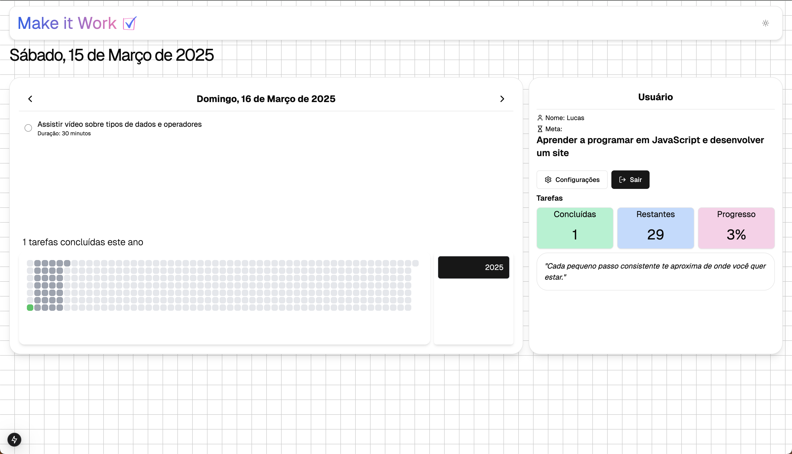

# Make It Work - Defina suas metas através de IA

## Domínio do Problema (Escopo)

Este aplicativo tem como objetivo ajudar os usuários a atingirem suas metas e objetivos de aprendizado, seja para desenvolver uma nova habilidade, praticar um hobby ou atingir qualquer tipo de meta pessoal. O sistema gera tarefas diárias baseadas no objetivo do usuário, acompanha o progresso e ajusta o cronograma automaticamente em caso de atrasos. O usuário é mantido motivado por meio de feedbacks, e o sistema garante que ele só inicie um novo objetivo após concluir o atual.

### Funcionalidades principais:

- **Objetivos personalizados**: O usuário define um objetivo (ex: aprender a tocar violão) para a IA e o aplicativo gera um cronograma com tarefas diárias específicas.
- **Acompanhamento de progresso**: O usuário pode marcar as tarefas como concluídas e visualizar seu progresso através de um heatmap interativo.
- **Atraso de tarefas**: Caso o usuário não complete uma tarefa no dia, ela será automaticamente movida para o próximo dia, ajustando o cronograma.
- **Previsão de tempo restante**: O heatmap exibe a previsão de tempo restante para concluir o objetivo, ajustando o tempo necessário conforme os atrasos.
- **Motivação e feedback**: O sistema oferece mensagens motivacionais e recomenda ajustes no cronograma com base no progresso do usuário.
- **Conquista e novos objetivos**: Quando o usuário completa um objetivo, ele é parabenizado, recebe um badge de conquista e pode definir um novo objetivo. O histórico de objetivos concluídos é armazenado.
- **Impedimento de novos objetivos**: O usuário não pode iniciar um novo objetivo antes de completar o atual.

## Tecnologias Utilizadas

- **NEXTJ**: Para construção da interface de usuário dinâmica e responsiva e criação de API.
- **SUPABASE**: Para armazenamento de dados.

## Requisitos Funcionais

### 1. Gestão de Objetivos

- **RF-01**: O sistema deve permitir que o usuário defina um objetivo de aprendizado.
- **RF-02**: O sistema deve permitir que o usuário edite um objetivo ativo antes de iniciá-lo.
- **RF-03**: O sistema deve impedir que o usuário crie um novo objetivo antes de concluir o objetivo atual.
- **RF-04**: O sistema deve armazenar um histórico de objetivos concluídos.

### 2. Geração e Gerenciamento de Tarefas

- **RF-05**: O sistema deve gerar automaticamente um cronograma com tarefas diárias com base no objetivo definido pelo usuário.
- **RF-06**: O sistema deve permitir que o usuário visualize as tarefas do dia.
- **RF-07**: O sistema deve permitir que o usuário marque uma tarefa como concluída.
- **RF-08**: O sistema deve adiar automaticamente uma tarefa não concluída para o dia seguinte.
- **RF-09**: O sistema deve recalcular o cronograma caso haja atrasos frequentes.
- **RF-10**: O sistema deve exibir um resumo do progresso do usuário.

### 3. Acompanhamento de Progresso

- **RF-11**: O sistema deve exibir um heatmap para visualização do progresso do usuário.
- **RF-12**: O sistema deve exibir a previsão de tempo restante para conclusão do objetivo.
- **RF-13**: O sistema deve notificar o usuário caso ele esteja atrasado no cronograma.

### 4. Motivação e Feedback

- **RF-14**: O sistema deve exibir mensagens motivacionais baseadas no progresso do usuário.
- **RF-15**: O sistema deve sugerir ajustes no cronograma caso o usuário esteja com dificuldades em completar as tarefas no prazo.
- **RF-16**: O sistema deve conceder badges de conquista ao usuário ao concluir um objetivo.

### 5. Autenticação e Gestão de Usuários

- **RF-17**: O sistema deve permitir que o usuário crie uma conta e faça login.
- **RF-18**: O sistema deve permitir que o usuário edite suas informações de perfil.

## Requisitos Não Funcionais (RNF)

### 1. Segurança

- **RNF-01**: O sistema deve armazenar senhas de forma criptografada.
- **RNF-02**: O sistema deve utilizar autenticação segura para login e gerenciamento de usuários.
- **RNF-03**: O acesso ao banco de dados deve ser protegido contra SQL Injection e outras vulnerabilidades.

### 2. Usabilidade

- **RNF-04**: O sistema deve possuir uma interface intuitiva e responsiva.
- **RNF-05**: O sistema deve funcionar corretamente tanto em desktops quanto em dispositivos móveis.
